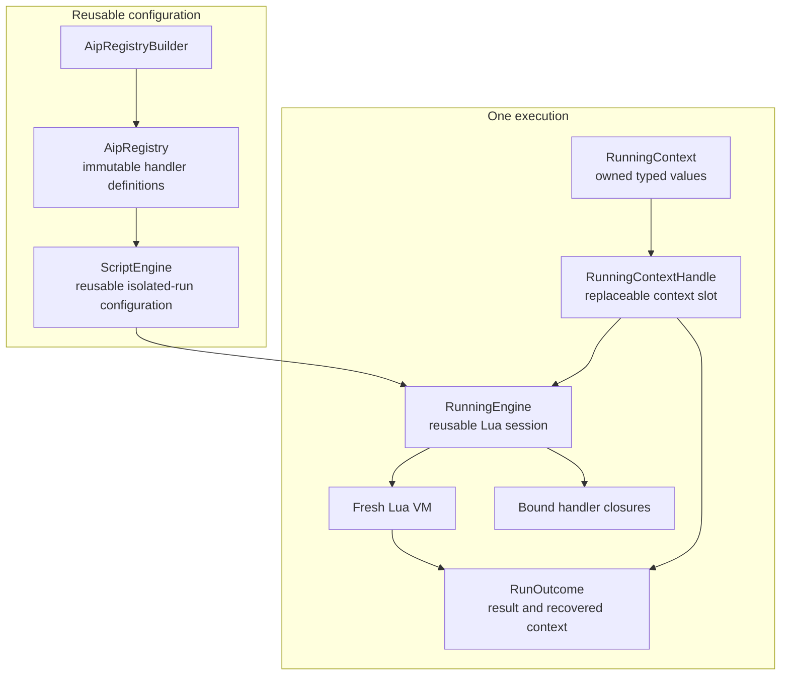

# Isolated Script Engine Architecture

## Intent

Provide isolated Lua script execution through reusable immutable configuration and per-run state.

`ScriptEngine` stores the reusable execution configuration. Each session creates a fresh Lua VM, binds the selected registry's handlers to a replaceable context slot, and executes scripts sequentially. Each completed execution takes the supplied `RunningContext` from the slot and returns it with the script result.

The implementation separates:

- Immutable API definitions in `AipRegistry`.
- Lua runtime configuration in `ScriptEngine`.
- Per-execution typed Rust state in `RunningContext`.
- One-run Lua state in `RunningEngine`.

[Lifecycle](#execution-lifecycle) | [Architecture](#architecture-at-a-glance) | [Registry](#registry-architecture) | [Context](#running-context) | [Runtime policy](#lua-runtime-policy) | [Errors](#error-and-context-recovery) | [Current limits](#current-limitations)

## Example

```rust
let registry = AipRegistryBuilder::default()
	.add_module(JsonModule)?
	.add_module(WebModule)?
	.build();

let engine = ScriptEngine::builder()
	.with_registry(registry)
	.build()?;

let mut context = RunningContext::default();
context.insert(String::from("execution state"));

let outcome = engine
	.exec("return 42", context)
	.await?;

let value = outcome.result?;
let context = outcome.context;
```

`outcome.result` contains either the script result or the script error. The `RunningContext` is recovered in either case when Lua state destruction and context recovery both succeed.

## Architecture at a glance



The reusable layer contains only immutable registry definitions, runtime policy, and native function installers. A session owns its Lua state and bound closures, while each execution temporarily owns the supplied context through the replaceable slot. The context is taken from the slot after each execution completes.

## ScriptEngine and LuaEngine

`ScriptEngine` is the public reusable engine configuration. `LuaEngine` is its private concrete Lua runtime implementation.

- `ScriptEngine` is the reusable, cloneable public engine configuration. It stores an `AipRegistry`, a `LuaRuntimePolicy`, and approved native function installers, but it does not own a Lua VM or a `RunningContext`.
- `ScriptEngine::start` creates a reusable `RunningEngine` session. That running engine owns a fresh private `LuaEngine`, its fresh Lua VM, the bound registry closures, and a replaceable `RunningContext` slot.
- `LuaEngine` is an implementation detail that constructs and executes the concrete Lua VM used by `RunningEngine`.

Use `ScriptEngine` for reusable policy configuration and session creation. Use `ScriptEngine::exec` for isolated one-shot executions, or use `ScriptEngine::start` when multiple sequential scripts must share Lua state and hand off Rust context.

## Execution lifecycle

The implemented execution lifecycle is:

1. Build an `AipRegistry` containing reusable handler definitions.
2. Build a `ScriptEngine` with the registry, Lua policy, and optional native functions.
3. Call `ScriptEngine::start` to create a session without an execution context.
4. Create a fresh restricted Lua VM for the session.
5. Create an empty replaceable context slot and a `HandlerCallContext` bound to that slot.
6. Bind registry handler factories to that stable call context.
7. Install native functions and bound handlers into Lua.
8. Return the `RunningEngine` session.
9. Supply an owned `RunningContext` to each `RunningEngine::exec` call.
10. Place the context into the slot and execute the Lua script.
11. Take the context out of the slot and return it in `RunOutcome`.
12. Drop the `RunningEngine` when the session is complete.

`ScriptEngine::start` exposes the explicit lifecycle:

```rust
let mut running = engine.start()?;
let outcome = running.exec(script, context).await?;
```

`ScriptEngine::exec` is the convenience operation that starts a session, executes one script, and drops the session:

```rust
let outcome = engine.exec(script, context).await?;
```

`RunningEngine::exec` borrows `&mut self`, so one running engine can execute multiple scripts sequentially while its Lua state persists. It takes the supplied context from the internal slot after each execution.

## Registry architecture

`AipRegistry` is an immutable, cloneable collection of reusable handler definitions. It shares definitions through `Arc<HandlerDefinition>` values rather than rebuilding schemas and handler factories for each run.

Each definition contains:

- Its dotted Lua path.
- Its synchronous or asynchronous kind.
- Parameter, output, and error schemas.
- Optional title and description metadata.
- A factory that binds a `HandlerCallContext` to a per-session Lua closure.

`AipRegistryBuilder` is the mutable construction API. It owns its current definition list and validates paths while definitions are added.

```rust
let base = AipRegistryBuilder::default()
	.add_module(JsonModule)?
	.add_module(WebModule)?
	.build();

let selected = base.select(
	["aip.json.*"],
	RegistrySelectionOptions {
		unmatched_patterns: UnmatchedPatternPolicy::Error,
	},
)?;

let extended = selected
	.to_builder()
	.merge(application_registry)?
	.build();
```

Registry composition has value semantics:

- `select` returns matching definitions in source registration order.
- `exclude` returns definitions not matching the supplied patterns.
- `to_builder` creates an independent builder while reusing shared definitions.
- `merge` preserves destination order, then appends source order.
- Duplicate paths are rejected.
- Existing registries are never mutated.

Pattern matching supports literal segments, `*` for one segment, and `**` for zero or more segments.

## Handler binding

Handler definitions are reusable, but Lua closures are execution-specific because they capture the current `HandlerCallContext`.

Before installing functions into Lua, `AipRegistry::bind` creates an internal `BoundRegistry`. Each entry contains a Lua closure generated from its immutable handler definition and the per-session call context.

The engine installs synchronous handlers with `Lua::create_function` and asynchronous handlers with `Lua::create_async_function`. Handler outputs are converted directly to Lua values. The script result is converted to `serde_json::Value` only at the script engine's public result boundary.

The private `LuaEngine` is created by `ScriptEngine` for each session. Context-dependent handlers are bound to a stable call context backed by the session's replaceable `RunningContext` slot.

## Running context

`RunningContext` is an owned type map keyed by Rust `TypeId`. It stores values that are `Any + Send + Sync + 'static`.

It provides typed insertion, retrieval, mutable retrieval, and removal:

```rust
let mut context = RunningContext::default();

context.insert::<u32>(42);
assert_eq!(context.get::<u32>(), Some(&42));

context.get_mut::<u32>().map(|value| *value += 1);
assert_eq!(context.remove::<u32>(), Some(43));
```

A `HandlerCallContext` exposes short scoped access to values while handlers execute:

```rust
let result = call_context.with::<MyService, _>(|service| {
	service.describe()
})?;

call_context.with_mut::<AuditLog, _>(|audit| {
	audit.record("handler called");
})?;
```

Internally, a `RunningContextHandle` uses `Arc<Mutex<Option<RunningContext>>>` while bound Lua closures exist. `HandlerCallContext::with` and `HandlerCallContext::with_mut` map missing values and poisoned locks to `ContextAccessError`.

The session places one owned context into the slot before each execution and takes it out afterward. Handlers must not retain `HandlerCallContext` after their work is complete. Retained handles are unsupported because they can access a context beyond the execution that supplied it and violate the session's context-handoff contract.

## Lua runtime policy

`LuaRuntimePolicy` defines the standard libraries and resource settings used for each fresh VM.

The default policy enables:

- Base.
- Coroutine.
- Math.
- String.
- Table.
- UTF-8.

The default policy disables:

- Package.
- IO.
- OS.
- Debug.

The base library is required. `ScriptEngineBuilder::build` rejects a policy that disables it.

```rust
let policy = LuaRuntimePolicy::default()
	.with_std_lib_policy(
		LuaStdLibPolicy::default()
			.with_package(false)
			.with_io(false)
			.with_os(false)
			.with_debug(false),
	)
	.with_limits(
		LuaExecutionLimits::default()
			.with_max_memory_bytes(16 * 1024 * 1024),
	);
```

`LuaExecutionLimits` supports configuring a maximum memory size, maximum instruction count, and wall-clock timeout. The current runtime applies memory limits through `mlua::Lua::set_memory_limit`.

`NativeFunctionSet` separately holds explicitly approved Rust installers. Native installers run after the Lua VM and registered handler functions have been created.

## Error and context recovery

The engine distinguishes script errors from lifecycle errors.

`RunOutcome<T>` contains:

```rust
pub struct RunOutcome<T, E = crate::Error> {
	pub result: core::result::Result<T, E>,
	pub context: RunningContext,
}
```

Compilation and runtime failures are stored in `RunOutcome::result`, allowing the recovered context to remain available.

If engine setup fails, `ScriptEngine::start` returns `EngineError::Start`, which contains an `EngineStartError`:

`-Setup` contains the setup source error. No context is supplied during session creation, so no context recovery is attempted.


If execution finishes but the context cannot be recovered, `RunningEngine::exec` returns `RunningEngineFinishError<T>`. It retains the script result alongside the recovery error.

`EngineError` wraps build, start, and finish-recovery errors for the convenience `ScriptEngine::exec` API.

## Isolation guarantees

Every `ScriptEngine::start` creates a fresh Lua VM for one session. Lua globals created by one execution remain available to later executions through that same `RunningEngine`, but are not available in separate sessions. Separate calls to `ScriptEngine::exec` create separate sessions and do not share Lua state.

The template can be cloned and shared because it contains immutable configuration. Each independent `RunningEngine` session receives its own:

- Lua VM.
- Bound Lua closures.
- `RunningContextHandle` and replaceable context slot.
- Supplied owned `RunningContext` for each execution.

The implementation includes tests confirming that globals do not leak across template executions and that context is returned after script and supported setup failures.

## Current limitations

The following constraints are intentionally enforced or remain unresolved:

- Instruction limits are configurable but currently rejected as unsupported.
- Wall-clock timeouts are configurable but currently rejected as unsupported.
- Cancellation does not yet have a dedicated public finish and context-recovery protocol.
- Context handoff uses a replaceable slot, and retained `HandlerCallContext` values remain unsupported.
- `LuaEngine` is private and is created only as part of a `ScriptEngine` execution.
- Lua policy and native function installation are separate controls. Restricting registry functions alone is not a complete sandbox.

## Implementation files

- `src/engine/script_engine/script_engine_impl.rs`, `ScriptEngine` configuration, fresh Lua VM creation, start and execution lifecycle.
- `src/engine/script_engine/lua_runtime_policy.rs`, standard-library and execution-limit policy types.
- `src/engine/script_engine/error.rs`, build, start, and context-recovery lifecycle errors.
- `src/engine/support/lua_engine.rs`, lower-level `LuaEngine` construction and execution APIs.
- `src/engine/support/lua_engine_register.rs`, registry binding and Lua function installation.
- `src/running_context.rs`, typed per-run state, scoped handler access, and recovery.
- `src/run_outcome.rs`, script result and recovered context container.
- `src/registry/registry_impl.rs`, immutable registry composition and binding.
- `src/registry/registry_types.rs`, registry metadata, handler wrapper traits, and selection errors.
