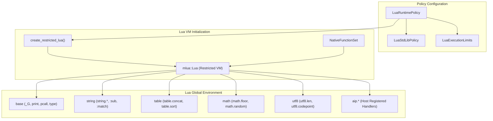

# Lua Runtime Policy and Sandbox Specification

## Intent

Define the configuration, standard library selection, sandboxing boundaries, and initialization lifecycle for Lua script execution within `ScriptEngine`.

This specification defines:

- Standard library policies and sandbox restrictions.
- Safe library features and their runtime behavior.
- Core functions provided by the Lua `base` library.
- Origin, role, and security implications of `print` and `require`.
- Unified initialization pipeline ensuring parity between production and test environments.

## Architecture Overview



The runtime policy acts as the sole authority for Lua VM construction. Lua VMs are created through `create_restricted_lua`, assembling a selective `mlua::StdLib` bitmask according to the configured policy.

## Policy Types

The policy configuration is structured into three primary types:

### LuaRuntimePolicy

The composite configuration container passed to `ScriptEngineBuilder`:

```rust
#[derive(Debug, Clone, Default)]
pub struct LuaRuntimePolicy {
	std_lib_policy: LuaStdLibPolicy,
	limits: LuaExecutionLimits,
}
```

### LuaStdLibPolicy

Controls the activation of each individual standard Lua library:

```rust
#[derive(Debug, Clone)]
pub struct LuaStdLibPolicy {
	pub base: bool,
	pub coroutine: bool,
	pub math: bool,
	pub string: bool,
	pub table: bool,
	pub utf8: bool,
	pub package: bool,
	pub io: bool,
	pub os: bool,
	pub debug: bool,
}
```

Default settings:

- `base`: `true` (Mandatory; disabling causes engine build failure)
- `string`: `true`
- `table`: `true`
- `utf8`: `true`
- `math`: `true`
- `coroutine`: `false`
- `package`: `false`
- `io`: `false`
- `os`: `false`
- `debug`: `false`

### LuaExecutionLimits

Configures runtime constraints:

```rust
#[derive(Debug, Clone, Default)]
pub struct LuaExecutionLimits {
	pub max_memory_bytes: Option<usize>,
	pub max_instructions: Option<u64>,
	pub wall_clock_timeout: Option<Duration>,
}
```

`max_memory_bytes` is applied to the Lua state via `mlua::Lua::set_memory_limit`. Unsupported limits (such as instruction limits and wall clock timeouts) are validated and rejected during engine construction.

## Standard Library Policy and Sandboxing

The default runtime configuration provides a restricted execution sandbox that permits rich data manipulation while eliminating arbitrary system access.

### Enabled Safe Libraries

- **`base`**: Provides language primitives, type inspection, error handling, and string conversion.
- **`string`**: Enables string manipulation routines and registers the string metatable, allowing string method syntax (such as `text:sub(1, 4)` and `text:match(...)`).
- **`table`**: Provides table manipulation utilities (`concat`, `insert`, `remove`, `sort`, `pack`, `unpack`).
- **`utf8`**: Provides Unicode code point handling and UTF-8 string length calculations (`utf8.len`, `utf8.char`, `utf8.codepoint`).
- **`math`**: Provides standard mathematical operations and constants (`floor`, `ceil`, `min`, `max`, `abs`, `random`, `pi`).

### Disabled Restricted Libraries

- **`package`**: Disabled. Prevents dynamic module loading, arbitrary file search paths, and loading host shared dynamic libraries (`.so`, `.dylib`, `.dll`).
- **`io`**: Disabled. Prevents direct host filesystem access (`io.open`, `io.read`, `io.write`).
- **`os`**: Disabled. Prevents process execution (`os.execute`), environment variable leakage (`os.getenv`), process exit (`os.exit`), and unrestricted file deletion (`os.remove`).
- **`debug`**: Disabled. Prevents introspection, stack inspection, and runtime hook tampering (`debug.getinfo`, `debug.sethook`).
- **`coroutine`**: Disabled by default. Can be enabled via explicit policy configuration if cooperative multitasking within Lua is required.

### Library Status Summary

| Library | Policy Flag | Default | Rationale / Security Consideration |
| --- | --- | --- | --- |
| `base` | `base` | `true` | Fundamental language runtime and global primitives. |
| `string` | `string` | `true` | String operations and string metatable method support. |
| `table` | `table` | `true` | Table utilities and array transformations. |
| `utf8` | `utf8` | `true` | UTF-8 character and byte offset utilities. |
| `math` | `math` | `true` | Pure mathematical operations. |
| `package` | `package` | `false` | Security risk: prevents `require` and dynamic library loading. |
| `io` | `io` | `false` | Security risk: prevents arbitrary host file system reads and writes. |
| `os` | `os` | `false` | Security risk: prevents shell execution, file removal, and process exits. |
| `debug` | `debug` | `false` | Security risk: prevents bytecode manipulation and stack tampering. |
| `coroutine` | `coroutine` | `false` | Disabled by default; safe to enable if cooperative tasks are needed. |

## The Base Library and Built-in Functions

The `base` library (`luaopen_base`) defines global symbols and fundamental language operations.

### Type and Value Inspection

- `type(v)`: Returns the type name (`"string"`, `"number"`, `"table"`, `"function"`, `"boolean"`, `"nil"`, `"userdata"`, `"thread"`).
- `tostring(v)`: Converts a value to its string representation, honoring `__tostring` metamethods.
- `tonumber(e [, base])`: Converts numbers or numeric strings to numbers.

### Error Handling and Control Flow

- `assert(v [, message])`: Raises a Lua runtime error if `v` evaluates to `false` or `nil`.
- `error(message [, level])`: Terminates execution and raises a runtime error with optional stack level.
- `pcall(f [, arg1, ...])`: Protected call; catches errors without terminating host execution.
- `xpcall(f, msgh [, arg1, ...])`: Protected call with a custom error handler callback.

### Iteration and Metatable Management

- `pairs(t)`: Iterates over all key-value pairs in a table.
- `ipairs(t)`: Iterates over sequential numeric indices starting from 1.
- `next(t [, index])`: Low-level table key iterator.
- `setmetatable(t, metatable)`: Assigns a metatable to a table.
- `getmetatable(t)`: Retrieves the metatable of a value.
- `rawget(t, index)`, `rawset(t, index, value)`, `rawequal(v1, v2)`, `rawlen(v)`: Primitive table operations that bypass metamethod invocations.

### Global Values and Diagnostic Output

- `_G`: Self-reference to the global environment table.
- `_VERSION`: String indicating the active Lua version (for example, `"Lua 5.4"`).
- `print(...)`: Formats and writes values to standard output.
- `select(index, ...)`: Returns elements from a variable argument list.
- `warn(msg1, ...)`: Emits warning messages.

## Built-in Functions: `print` vs `require`

### `print` Location and Behavior

`print` belongs to the **`base`** library:

- It is loaded directly into the global environment when `base` is enabled.
- Because `base` is required by `ScriptEngine`, `print(...)` is available in all scripts.
- Output from `print` is handled by the host standard output stream.

### `require` Location and Sandbox Protection

`require` belongs to the **`package`** library (`luaopen_package`):

- `require` resolves modules using `package.path`, `package.cpath`, and searcher functions.
- In `ScriptEngine`, `package` is disabled by default (`package: false`).
- Attempting to call `require("module")` in a standard script evaluates to `nil`, preventing unauthorized module loading.

### Security Rationale for Disabling `require`

1. **Filesystem Isolation**: Disabling `require` prevents scripts from traversing arbitrary filesystem paths to locate `.lua` files.
2. **Binary Code Execution**: Disabling `package.cpath` prevents loading native binary objects (`.so`, `.dylib`, `.dll`) into the host process.
3. **Controlled Capability Model**: All external capabilities must be explicitly registered as typed handlers in `AipRegistry` (under `aip.*`).
4. **Context Boundaries**: Host file access is exposed only through `aip.file.*` handlers, which enforce root directory constraints via `DirContext`.

## Unified Initialization Pipeline

To eliminate configuration drift between production and test runs, the engine adheres to a single initialization source of truth:

```rust
fn create_restricted_lua(policy: &LuaRuntimePolicy) -> mlua::Result<Lua> {
	let std_lib_policy = policy.std_lib_policy();
	let mut std_libs = StdLib::NONE;

	if std_lib_policy.coroutine {
		std_libs |= StdLib::COROUTINE;
	}
	if std_lib_policy.math {
		std_libs |= StdLib::MATH;
	}
	if std_lib_policy.string {
		std_libs |= StdLib::STRING;
	}
	if std_lib_policy.table {
		std_libs |= StdLib::TABLE;
	}
	if std_lib_policy.utf8 {
		std_libs |= StdLib::UTF8;
	}
	if std_lib_policy.package {
		std_libs |= StdLib::PACKAGE;
	}
	if std_lib_policy.io {
		std_libs |= StdLib::IO;
	}
	if std_lib_policy.os {
		std_libs |= StdLib::OS;
	}
	if std_lib_policy.debug {
		std_libs |= StdLib::DEBUG;
	}

	let lua = Lua::new_with(std_libs, LuaOptions::default())?;
	if let Some(max_memory_bytes) = policy.limits().max_memory_bytes {
		lua.set_memory_limit(max_memory_bytes)?;
	}

	Ok(lua)
}
```

### Key Initialization Invariants

1. **No Standalone Test Constructors**: `LuaEngine` contains no test-only constructors (`new()`, `new_context_free()`, `from_registry()`).
2. **Single Construction Path**: All Lua states, including test executions and doc generation, are instantiated via `ScriptEngine::builder()` and `create_restricted_lua`.
3. **Zero Dead Code**: Production builds contain no unused initialization helpers or `#[allow(dead_code)]` suppressions.
4. **Test Fidelity**: All integration tests exercise the exact policy assembly and sandboxing constraints enforced in production.
